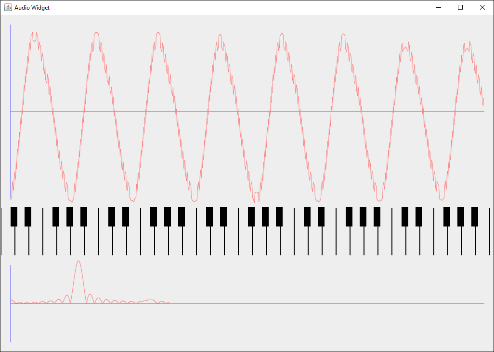

AudioWidget
===========

Just some playing around with audio data.

Try `gradle runme`.

So far:
* Shows raw audio capture data in the top graph.
* Shows strength of signal for frequencies in the bottom graph.
* Placeholder piano keyboard for showing which notes are being played.

